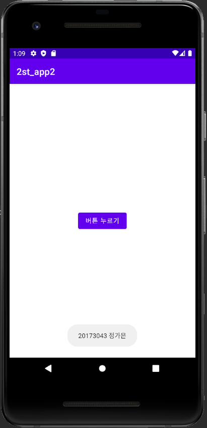

# 캡스톤디자인 안드로이드앱프로그래밍

## 1주차
</img>
## 2주차
  - Github 사용법
  - 안드로이드앱 프로그래밍 시작
    - Toast 알림
    - AVD 시작하기
      
</img>

## 3주차
  - 3주차 과제
    - 네이버 화면
    - 전화번호 입력창 화면
    
 </img>
 </img>

## 4주차
  -   내가 만들고 싶은 앱 기획 아이디어
       - 심리테스트로 자신에게 어울리는 향수를 추천해주는 앱
          향수를 잘 모르는 사람이나 향수 입문자 등 다양하고 많은 향수들 중 어떤 향수를 써야할지 모르겠을 때 이 앱을 쓰면 유용할 것이라 하고 생각했다. 다른 사람이 생각하기 전에 나부터가 향수에 대해 잘 모르고 써본적이 없기에 이러한 아이디어가 떠올랐다. 이 심리테스트는 몇가지 질문들을 통해 개개인에게 맞는 향수를 뽑아준다. 좋아하는 계절, 평소 향수를 자주 사용하는지의 빈도수 등등 다른 질문들도 포함된다. 더해 웃으며 볼 수 있는 재미로 나와 잘 맞는 성향을 가진 이성의 향수와 나와 안 맞는 이성의 향수도 알려준다. 향수에 관심이 많이 없던 나 그리고 이용자가 이런 테스트로 인해 흥미를 느끼고 관심을 가지며 본인에게 추천받은 혹은 어울리는 향수를 구매까지 이어지게 하는 것이 이 앱의 궁극적 목적이다.  
        

